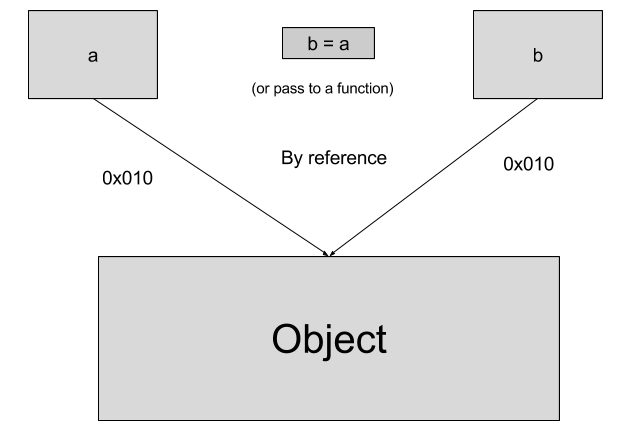

### Assignment (=) operator used between primitives
Let me explain what does this mean through an example

```javascript
   var a = 3;
   var b;
   b = a; // here a , b are primitive values
   console.log(a + "," + b); // prints 3 , 3
   a = 4;
   console.log(a +","+ b); // prints 4, 3
```
It looks simple and it is simple but I would like to explain what is happening under the hood. When assignment operator is used on primitives (b = a), new memory address location for ‘b’  is created and the  value of ‘a’  is copied to b’s address location. Therefore, a has separate memory location holding value 3 and b has separate memory location holding value 3 and hence changing a = 4 later on wont't change the value of b. Figure below shows how JS engine evaluates these assignments


### Assignment (=) operator used between objects
Once again let me go through an example

```javascript
   var a = {greet: 'Hello'};  
   var b;
   b = a;
   console.log(a,b); // it will print two objects  {greet: 'Hello'} and {greet: 'Hello'}
   a.greet = 'Servus';
   console.log(a,b);// it will print two objects {greet: 'Servus'} and {greet: 'Servus'} even though we have not changed 'b'
```
This is because 'b' is pointing to the same memory location where 'a' is pointing to. There is single object {greet: 'Hello'} in a memory and both 'a' and 'b' points to same location because of which if main object is changed, its effect both 'a' and 'b'. Figure below shows how reference of an object is used in case of object assignment.


