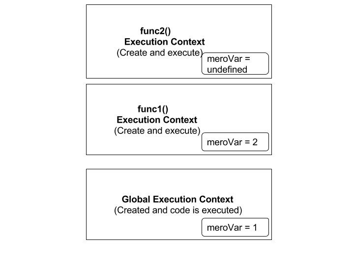
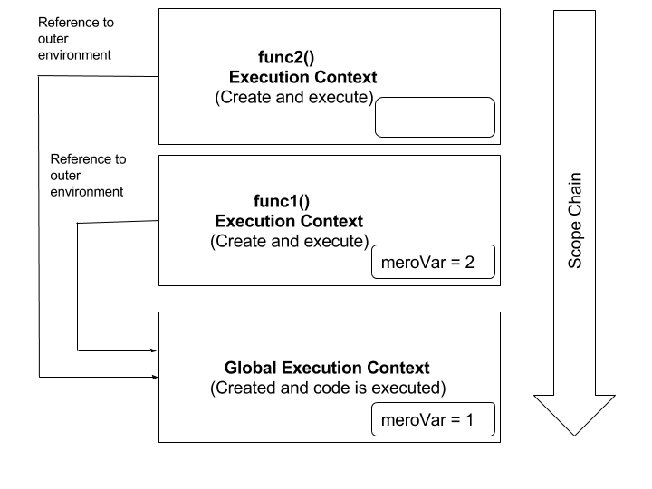

### What is JavaScript execution context stack?
Whenever JS engine runs a piece of code, the environment in which it is executed is called execution context where variables and functions are actually resolved or executed.

Whenever a function is invoked, JS engine creates a new execution context and pushes it on top of the global execution context. Once a function finishes its execution, it is poped out from the stack. Let me explain it through an example.

Let's say we have following block of code and lets try to guess what would be the result.

```javascript
    function func2() {
      var meroVar;
      console.log(meroVar);
    }
  
    function func1() {
      var meroVar = 2;
      func2();
      console.log(meroVar);
    }
  
   var meroVar = 1;
   func1();
   console.log(meroVar);
```

It will print undefined , 2 and 1. So, whats actually happening here? When `func1()` is invoked, a new execution context for `func1()` is created with its own variable environment and pushed on top of global execution context. Similarly, when `func2()` is called inside func1(), new execution context is created and push on top position as shown in figure below. JS engine executes top most execution context and remove it and goes thoughly below the stack as described in the diagram below.

 

### What is scope chain?
For each execution context there is scope chain associated with it. Scope chain is used for determining variable access and identifier resolution. Lets modify our previous example to understand about scope chain.

```javascript
    function func2() {
      console.log(meroVar);
    }
  
    function func1() {
      var meroVar = 2;
      func2();
      console.log(meroVar);
    }
  
   var meroVar = 1;
   func1();
   console.log(meroVar);
```
Notice `func2()`, we have removed `var meroVar;` from the function. Now run this code, what do you expect?....
It will print 1, 2, 1. First of all execution context of `func2()` tries to find the value of meroVar within its own context but if it can't resolve the value in its own execution context than it tries to go through the execution context associated with its scope chain. Here, `func1()` and `func2()` are created in the global context similar to a variable declaration `var meroVar = 1;`, therefore execution context of `func2()` and `func1()` has reference to an outer environment as shown in the figure below. 


