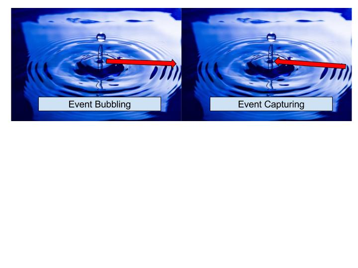

Before understanding event delegation let see what wikipedia says about `Delegation` "Delegation is the assignment of any responsibility or authority to another person". 
In the world of JS, event delegation means assigning responsibility of one element to another element. Event delegation allows us to avoid defining individual event listeners for child elements. Let me explain it through an example.
Let's say we have a parent and child dom elements as shown below

```javascript
<script>
 var parent = document.getElementById('parent');
 
 //create event listener on parent
 parent.addEventListener('click', function(event) {
  //whenever a child is clicked, parent's event handler is called because of event bubbling.
   console.log("Element: ", event.target.id, " was clicked.");
 },false);// false means prevent event capturing
 
</script>

<ul id="parent">
  <li id="child1"> child 1 </li>
  <li id="child2"> child 2 </li>
  <li id="child3"> child 3 </li>
  <li id="child4"> child 4 </li>
  <li id="child5"> child 5 </li>
 </ul>
```

We can add event listener on each child element but we might have situation where the number of child element is unknown or dynamically added. In this situation event delegation becomes handy. Because of property event bubbling i.e whenever event occurs in the innermost element, its event is propagated upwards towards parent. Similary, event capturing means whenever event occurs on parent element, it is propagated towards downward as described in the diagram below.


