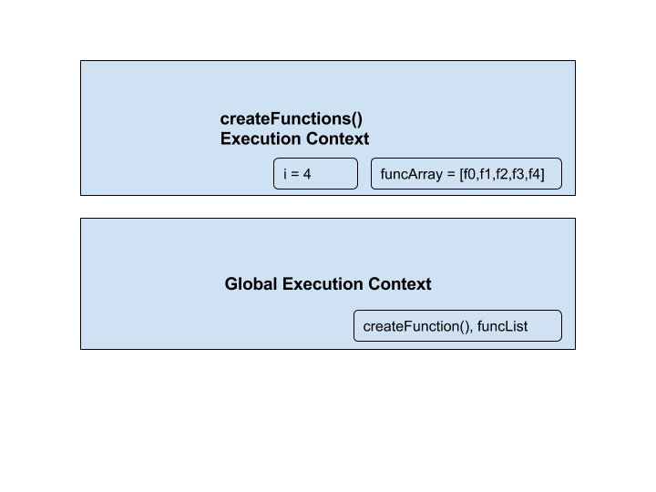
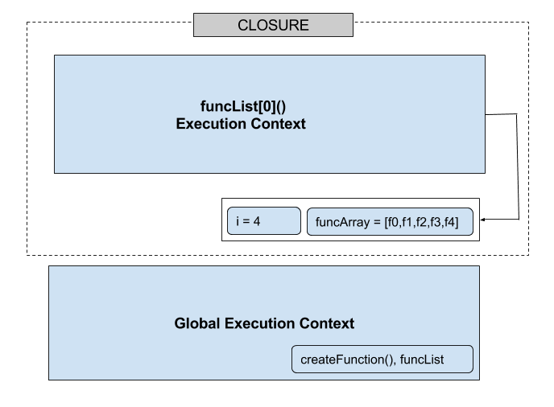

In this post I will explain, how variables are referenced from execution content in case of closure with an example. Let's begin with an example below.

```javascript
function createFunctions() {
    var funcArray = [];
    for(var i=0; i< 4; i++) {
      funcArray.push(function() {
        console.log(i);
      });
  }
    return funcArray;
  }

  var funcList = createFunctions();
  funcList[0](); // prints 4
  funcList[1](); // prints 4
  funcList[2](); // prints 4
  funcList[3](); // prints 4
```

Here, we might expect it to print 0,1,2,3 but this is not the case. Inside `createFunctions()`, we are pushing functions to an array `funcArray` in each for loop and note that we are not executing those functions. Lets try to execute it step by step. When JS engine encounters line `var funcList = createFunctions()` during interpretation phase in a global content, it tries to execute `createFunctions()` which creates a new execution context on top of the execution context stack. Inside `createFunctions()` when, `i=0` it will push a `function()` to an array `funcArray`. Until `i=3` it will push function into an array. But when the final value of `i` is 4, it finishes the for loop and returns `funcArray`. Note that the function being pushed in an array uses variable `i` and it can be  accessed by any outer variable even if `createFunctions()` method finishes its execution and poped out from the execution stack. Figure below shows execution context of `createFunction()` with  variables and values.



When `createFunctions()` is poped out from the execution context stack, scope chain has access to the environment variable `i=4`. When `funcList[0]()` method is called, new execution context is created and JS engine tries to execute code inside this function. When it finds variable `i`, it tries to find within that function, if it is not avaible there, it tries to find in the outer function and goes through the socpe chain and finall retrieves the value from the previous execution context as shown in the figure below.


